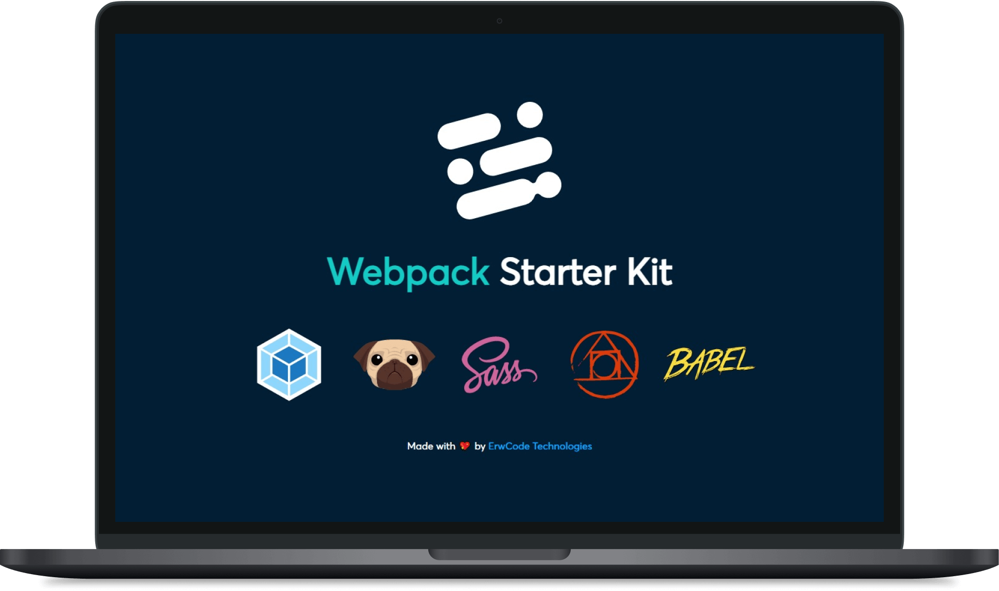

# Webpack Starter Kit

[![node][node]][node-url]
[![npm][npm]][npm-url]
[![MIT License][mit-license-image]][mit-license-url]
[![GitHub contributors][contributors]][contributors-url]
![GitHub package.json version][version-url]

This Webpack starter kit comes with several tools and opinionated choices for your front-end development projects.

Its main purpose is to bundle JavaScript files for usage in a browser.



> A starter kit workflow using Webpack, PUG, SASS, PostCSS & Babel.

## ⚙️ Installation
Clone the repository and substitute `my-project` for your real project name.

```sh
 git clone https://github.com/erwcode/webpack-starter-kit.git my-project
```

Once repository has been cloned, open its location from the terminal and install the npm dependencies.

```sh
 npm install
```


## 🚧 How is it work?
By setting the mode parameter to either development, production, you can enable webpack's built-in optimizations that correspond to each environment.

- `npm run dev` - build in development mode
- `npm run build` - build in production mode

Also, you can use webpack with a development server that provides live reloading. This should be used for development only.

- `npm start` - build and watch changes


## 🌳 Directory Tree

```
📦webpack-starter-kit
├─ 📂src
│  ├─ 📂fonts
│  │  └─ Averta.woff
│  ├─ 📂images
│  │  ├─ babel.svg
│  │  ├─ favicon.png
│  │  ├─ isotipo.svg
│  │  ├─ mockup.png
│  │  ├─ postcss.svg
│  │  ├─ pug.svg
│  │  ├─ sass.svg
│  │  └─ webpack.svg
│  ├─ 📂pug
│  │  ├─ 📂includes
│  │  │  └─ logo.pug
│  │  ├─ 📂pages
│  │  │  └─ index.pug
│  │  └─ template.pug
│  ├─ 📂scss
│  │  ├─ 📂base
│  │  │  └─ _reset.scss
│  │  ├─ 📂components
│  │  │  └─ _logo.scss
│  │  ├─ 📂layout
│  │  │  └─ _l-container.scss
│  │  ├─ 📂settings
│  │  │  ├─ _fonts.scss
│  │  │  ├─ _mixins.scss
│  │  │  └─ _variables.scss
│  │  ├─ 📂state
│  │  │  └─ _is-active.scss
│  │  ├─ 📂theme
│  │  │  └─ _dark.scss
│  │  └─ main.scss
│  └─ index.js
├─ .babelrc
├─ .editorconfig
├─ .gitignore
├─ LICENSE
├─ README.md
├─ package-lock.json
├─ package.json
├─ postcss.config.js
└─ webpack.config.js
```

## 🍻 Contributors

| Name                                                           | Role                                       |
|:---------------------------------------------------------------|:-------------------------------------------|
| [Erwin Alan Frías Martínez](https://github.com/erwinfriasmtz)  | Front-End Developer                        |

### ⚖️ Copyright and License

Made with 💖 by [ErwCode Technologies](https://erwcode.com/).


[npm]: https://img.shields.io/npm/v/webpack.svg
[npm-url]: https://npmjs.com/package/webpack

[node]: https://img.shields.io/node/v/webpack.svg
[node-url]: https://nodejs.org

[mit-license-image]: https://img.shields.io/github/license/erwcode/webpack-starter-kit.svg
[mit-license-url]: https://github.com/erwcode/webpack-starter-kit/blob/master/LICENSE

[contributors]: https://img.shields.io/github/contributors/erwcode/webpack-starter-kit.svg?color=orange
[contributors-url]: https://github.com/erwcode/webpack-starter-kit/graphs/contributors

[version-url]: https://img.shields.io/github/package-json/v/erwcode/webpack-starter-kit.svg?color=red